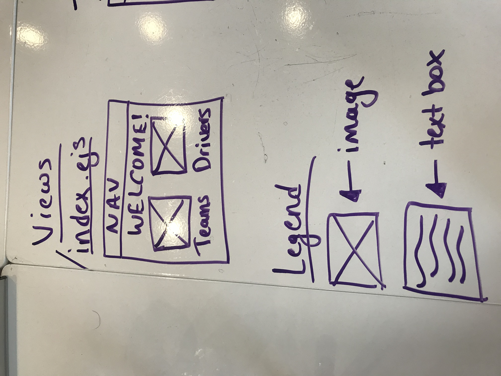
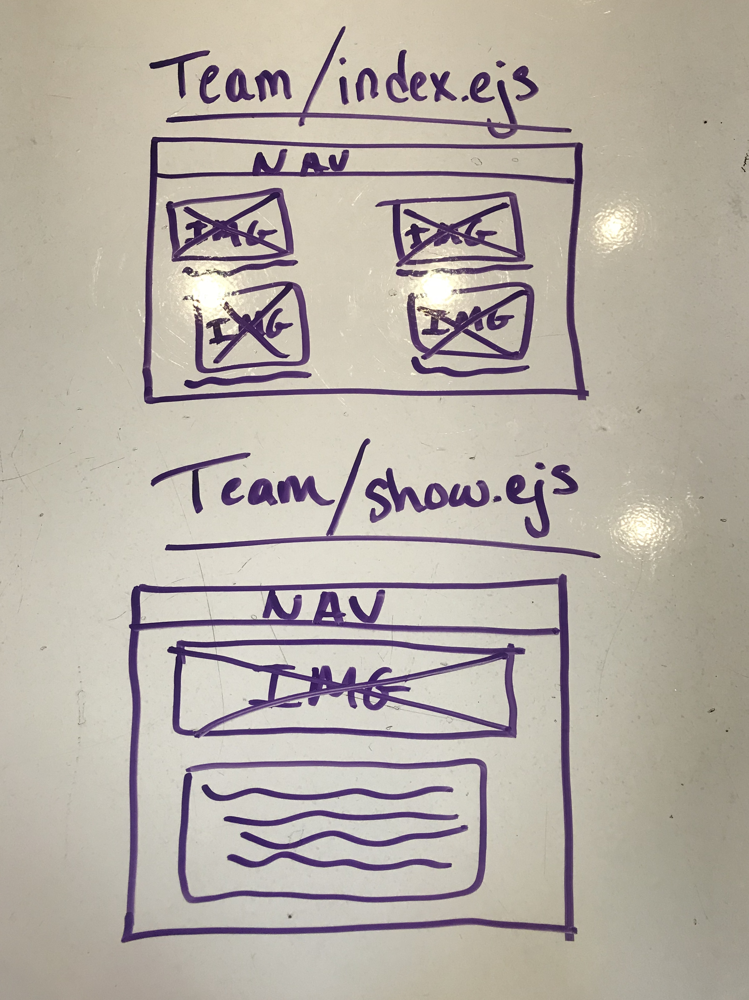
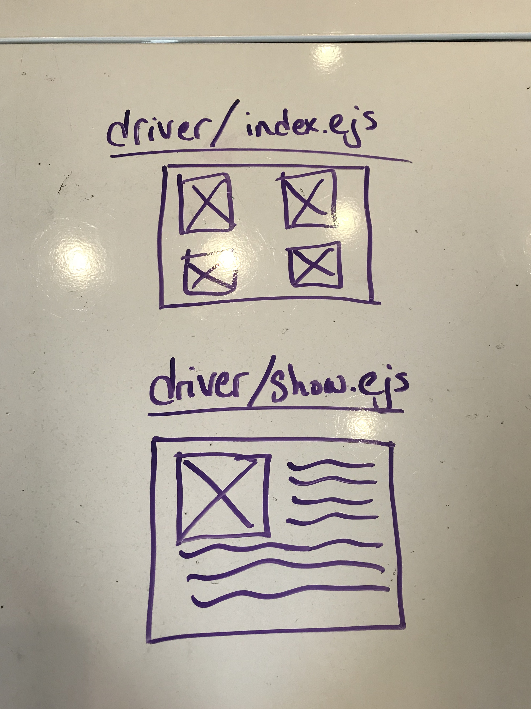
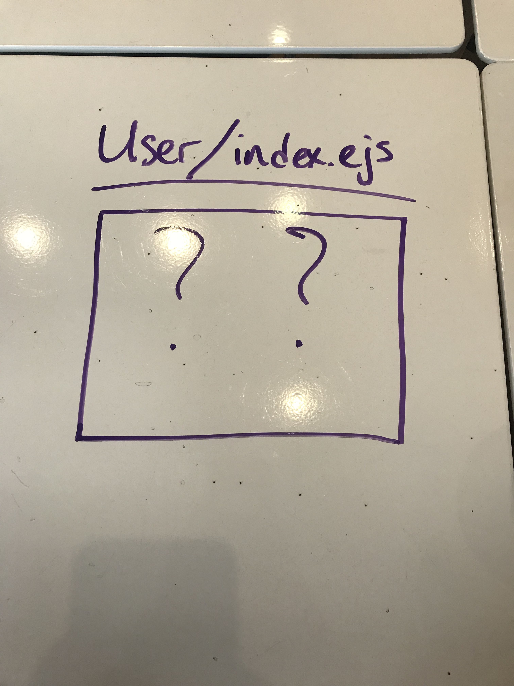
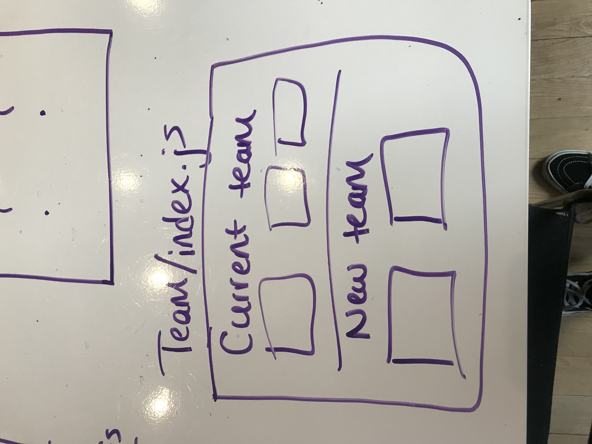

# formula-team-app

## Summary

This app is based off of Forumla One. You will be able to view the teams and driver in the current 2018 season. You can create, delete or edit a dream team. You choose the team you like and any driver. 

## User Experience

The user will be able to see the current teams that are currently taken part in the 2018 season. They will also see the current drivers that are in the season. They will be able to see the information on each team and each driver respectively. They will also have ability to create there own dream team. They can choose the team of there choice in the current season and the drivers they would pair up in that chosen team. 

## Video Presentation
https://www.youtube.com/watch?v=c6mbxla9G-c&feature=youtu.be

## Features

- Express
- PSQL
- MVC
- CRUD

## MVP

- Set up structure with MVC
- Have a full working Server
- MVC working with a functional CRUD
- CSS

## Wireframe

## Time Management
| Component | Priority | Estimated Time | Time Invetsted | Actual Time |
| --- | :---: |  :---: | :---: | :---: |
| Structure Setup | L | 30 mins| 30 mins | N/A |
| MVC | H | 6 hrs| 6 hrs | N/A |
| CRUD functionality | H | 24 hrs| 24hrs | N/A |
| Total |  | 30 1/2 hrs| 30 1/2 hrs | N/A |

## Download & Localhost
Click on the repository and then click on Formula one team app. On the right you will see a green button called clone or download. Click on it, copy the link and git clone it to your terminal desktop. After you do that run npm init if you have to. If not, do npm run dev. Your server will load up and will give you a localhost number. Go into your browser and do localhost:3000 for example and it will appear.
